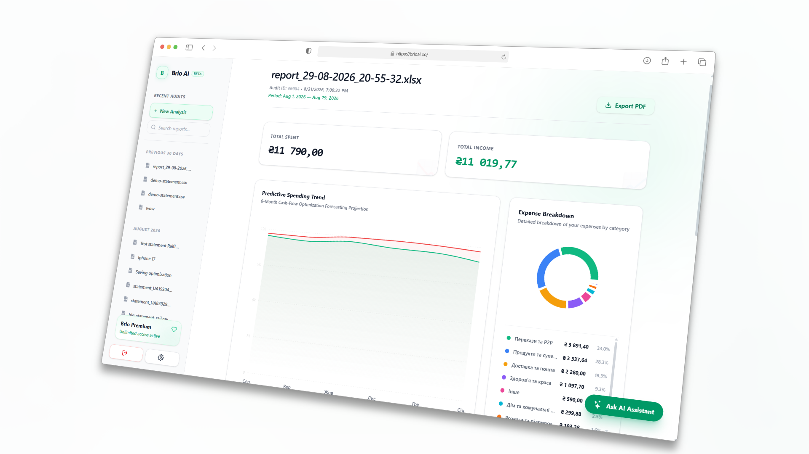
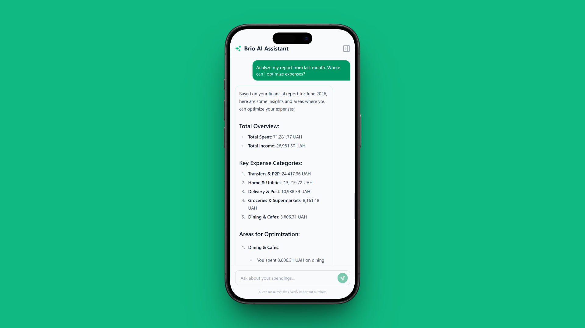
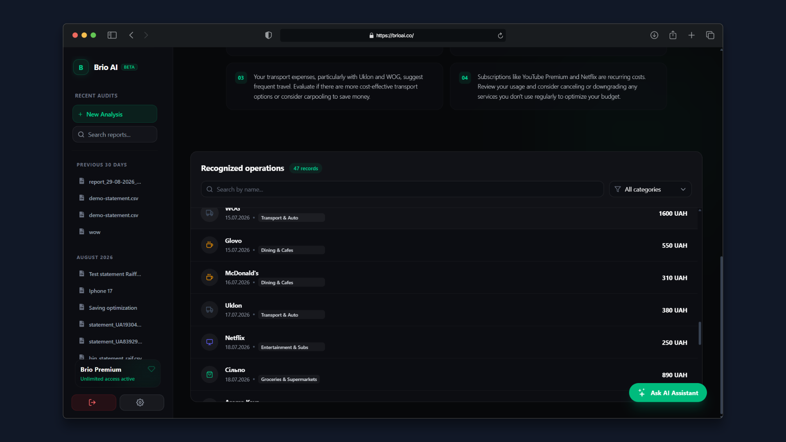
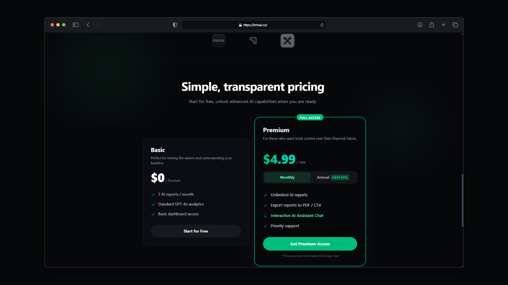
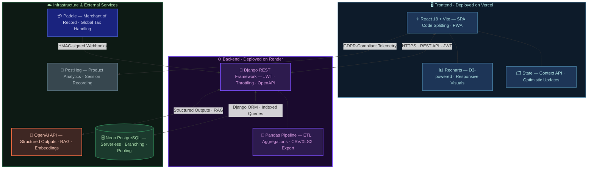

  
  
  # Brio AI — Freemium SaaS Financial Analytics
  
  
  
  
  > **Note:** Brio AI is a proprietary micro-SaaS application. This repository serves as a technical showcase of its architecture, engineering challenges, and sanitized code snippets to demonstrate code quality and architectural patterns.
   
  
  ### 📺 [Watch the 3-minute Architectural Walkthrough](https://youtu.be/iMvvE2OpH8M)
  *See the Pandas pipeline, RAG-assistant, and Paddle webhooks in action.*

---

## Executive Summary

Brio AI is a comprehensive freemium financial analytics platform designed to eliminate manual expense tracking. It allows users to upload local bank statements (CSV/XLSX) for automated categorization, visual analysis, and AI-driven insights. 

Beyond basic categorization, the platform features a fully integrated **RAG-powered AI Assistant** capable of context-aware financial assisting, and seamless handling of user billing and internal premium upgrades via secure Paddle webhooks.

## 🖥 UI & Feature Gallery

<table align="center">
  <tr>
    <td align="center">
      
       <b>Interactive Data Dashboard</b>
    </td>
    <td align="center">
      
       <b>RAG-Powered Contextual Assistant</b>
    </td>
  </tr>
  <tr>
    <td align="center">
      
       <b>Memoized Client-Side Filtering</b>
    </td>
    <td align="center">
      
       <b>Freemium & Paddle Integration</b>
    </td>
  </tr>
</table>

# System Architecture & Tech Stack

### 🛠 Tech Stack
*   **Frontend (Client):** React 18+, Vite, Tailwind CSS, Recharts (6-month Predictive Spending Trend, Volume Segmentation), i18n, React Context. Deployed on Vercel.
*   **Backend (API & Processing):** Django, Django REST Framework (DRF), Pandas for robust data ingestion. Deployed on Render.
*   **Database:** Serverless PostgreSQL hosted on Neon.tech.
*   **AI & RAG:** OpenAI API (GPT-4o-mini) utilizing advanced Prompt Engineering, Structured Outputs (Pydantic), and Function Calling.
*   **Payments & Auth:** Paddle (Merchant of Record) via secure webhooks, django-allauth (JWT + Google OAuth2).
*   **Analytics & Compliance:** PostHog (Opt-in cookie management for GDPR/CCPA compliance).

---

## Engineering Challenges & Solutions

### 1. Smart Data Ingestion & Categorization Pipeline
**The Challenge:** Users upload bank statements from various local banks, each with completely different CSV/XLSX headers, date formats, and structures. Relying solely on LLMs to categorize thousands of rows per upload is cost-prohibitive and introduces high latency.
**The Solution:** 
*   **GoF Patterns:** Implemented a robust `BankParserFactory` and Strategy pattern (`BaseBankParser`) using Pandas to dynamically detect and normalize disparate bank formats into a single unified schema.
*   **4-Tier Cascading Algorithm:** To optimize OpenAI API costs, transactions pass through a waterfall categorization pipeline: 
    1. *MCC Lookup* (Instant matching based on merchant codes).
    2. *Direct Description Match* (Database lookup of previously verified merchants).
    3. *Keyword Dictionary* (Regex-based fallbacks).
    4. *AI-Generated Fallback* (Micro-requests to OpenAI using Structured Outputs strictly for remaining unknown entities).

### 2. RAG-Powered Financial Assistant
**The Challenge:** Standard LLM wrappers provide generic financial insight and hallucinate mathematical calculations when analyzing specific user data.
**The Solution:** 
Developed a context-aware AI assistant using Retrieval-Augmented Generation (RAG). The backend injects the user's specific financial goals and normalized transaction history into the prompt context. To guarantee deterministic mathematical accuracy for financial queries, the AI utilizes **custom function-calling** (e.g., an integrated calculator tool). Responses are strictly enforced via Pydantic schemas (`client.beta.chat.completions.parse`) to ensure the frontend always receives predictable JSON data for UI rendering.

### 3. Cost-Effective Freemium Architecture
**The Challenge:** Maintaining a freemium model requires resetting free credits (e.g., `free_analyses_left`) every 30 days and managing premium subscriptions without inflating server costs with heavy background workers like Celery + Redis.
**The Solution:** 
*   **Serverless Cron:** Replaced Celery with lightweight GitHub Actions Cron Jobs that hit secured backend endpoints to process monthly credit resets.
*   **Secure State Machine:** Integrated Paddle webhooks using HMAC SHA-256 cryptographic validation to prevent spoofing. Implemented a business-logic "Grace Period" that allows canceled users to retain premium access exactly until their billing cycle concludes, updating the PostgreSQL database asynchronously.

---

## Featured Code Snippets

The `/core-snippets` directory contains sanitized, production-ready code samples isolated from the main repository. These files demonstrate code quality, type safety, and architectural decisions.

### ⚡ Backend (`/core-snippets/backend`)
*   [`bank_strategy_pattern.py`](./core-snippets/backend/1_bank_strategy_pattern.py) — Demonstrates the implementation of the Factory and Strategy GoF patterns for dynamic CSV statement ingestion and format sniffing.
*   [`ai_analysis.py`](./core-snippets/backend/2_ai_financial_analysis.py) — Showcases modern OpenAI API usage with Structured Outputs (Pydantic) for AI categorization fallback and predictive UI data formulation.
*   [`paddle_webhook.py`](./core-snippets/backend/3_paddle_webhook_grace_period.py) — Highlights security-first webhook processing, HMAC cryptographic validation, and the subscription state machine (Grace Period logic).

### 🎨 Frontend (`/core-snippets/frontend`)
*   [`api.ts`](./core-snippets/frontend/api.ts) — An advanced Axios interceptor implementing JWT refresh token rotation with a Mutex/Promise queue to prevent race conditions during concurrent 401 requests.
*   [`AnalysisForm.tsx`](./core-snippets/frontend/AnalysisForm.tsx) — A complex, localized Drag-and-Drop UI component with event-driven PostHog analytics tracking and dynamic Tailwind styling.
*   [`useSidebarData.ts`](./core-snippets/frontend/useSidebarData.ts) — A custom hook demonstrating the "Headless Component" pattern: separating business logic, managing local state updates (to avoid network refetches), and handling client-side pagination.
*   [`ThemeProvider.tsx`](./core-snippets/frontend/ThemeProvider.tsx) — An enterprise-grade theme provider featuring system preference media queries, dynamic favicon swapping, and cross-tab synchronization via Storage events.

## 🔒 Privacy & Data Minimization

Security and privacy are foundational to Brio AI's architecture. The platform operates on a strict **data minimization** principle:
* **In-Memory Processing:** Uploaded statements (CSV/XLSX) are parsed entirely in-memory and immediately purged. Raw bank files are never stored on our servers.
* **No PII Storage:** The ingestion pipeline extracts only transaction amounts, dates, and vendor descriptions. Personally Identifiable Information (Name, Tax ID, Address) is systematically ignored.
* **User Control:** For maximum peace of mind, users can manually delete any rows containing sensitive personal details prior to upload without breaking the parsing strategy.
